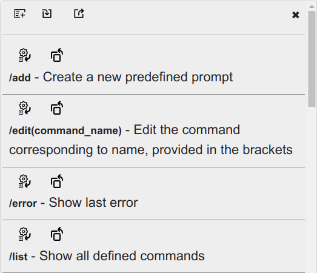

# localAI

### Use local AI within the browser


- [Usage](#usage)
- [The Panel](#the-panel)
    - [Ribbon](#ribbon)
        - [Menu](#menu)
        - [Session](#session)
- [System Instructions](#system-instructions)
    - [Other](#other)
    - [Prompt area](#prompt-area)
        - [Attach file](#attach-file)
        - [Commands](#commands)
            - [System commands](#system-commands)
            - [Custom Commends](#custom-commands)
- [Options](#options)
    - [End Points](#end-points)
        - [Models](#models)
    - [Web Hooks](#web-hooks)
        - [Format](#format)
- [Troubleshoot](#troubleshoot)
    - [Ollama](#ollama)
        - [403 Error](#403-error)

---

Oh! Antohter AI tool!

Why, indeed? Well, even those AI tools that support web browsing can't reach all web content. If interested in the topic, search the web or take a look [here](https://www.technologyreview.com/2024/03/19/1089919/the-ai-act-is-done-heres-what-will-and-wont-change/).

In short, AIs are not allowed to access all content. But you, as a user, can. Why not interact with the page right in the current tab? This is where this tool comes in handy. It can use the content loaded into a tab, allowing it to help you with tasks such as summarising. It is a helper that can use the information available to you as a user and can't go beyond that.

So, what can it do? It works with your current active tab only. It keeps all data local—no sharing, sending, or storing your actions for later. You have full control. You decide whether to keep it or delete it.

Additionally, you can define, store (locally, of course), and execute predefined prompts.

Apart from that, it works like any other AI UI—ChatGPT, Ollama, Llamafile, etc. It is just an interface to your preferred local AI tool.

Supported tools are (those providing a local endpoint API):

* [LM Studio](https://lmstudio.ai/)
* [Ollama](https://ollama.com/)
* [Mozilla LlamaFile](https://github.com/Mozilla-Ocho/llamafile)

To use it, you need:

> [!IMPORTANT]
>
> If you are a Firefox user, please read [this](ff.md).
>

1. One or more of these services running on your local system.
2. An extension for your browser.

| | Browser | Extension |
|-|---------|-----------|
|  | Chrome |  [link](https://chromewebstore.google.com/detail/local-ai-helper/mplpnjanhjddepeecpmjbglbiccdhnfp)|
|  | Firefox |  [link](https://addons.mozilla.org/addon/local-ai-helper/)|


Upon installation of this extension, you'll see the icon in the bottom-right corner. It will respond to mouse hover/over.


Click it to open the main UI.


# Usage

Hover the top of the head on the bottom right corner with the mouse and the head will come out:


The red cross near the ear allows temporarily hiding the head—only for the current tab and until it is reloaded.


Click the head to open the panel.

# The panel

## Ribbon


The ribbon at the top gives some quick access options:
From left to right there are:

### Menu
Click to toggle the menu


The changes made here are temporary for the session, (until reload) and for the current tab only.


* On the top is the API endpoint where AI prompts are sent to.
* If [Ollama](https://ollama.com/) is used as an endpont, next dropdown will be populated with the available model names. **It is mandatory** to select one, otherwise an error will be trown.
* See [Web Hook](#web-hooks) for more information
* Create a new prompt and save it for future use.
* Show a list of predefiend and save prompts.
* Show a list of the availabel system commands.
* The last menu will open extension's options in a new tab.

### Session
 - new session

 - Show session list. Click to reload any.

 - Delete sessions

Sessions can be managed also from the [Options](#options) page.

# System instructions

 - Edit system instructions. **Only for the session**. Use the [Options](#options) page to set permanent system instructions.


## Other

 - Pin panel.

 - Unpin panel.

If the pannel is not pinned (default) then clicking outside the panel will hide it. This behaviour can be changed from the [Options](#options) page.

 - Hide the panel

## Prompt area
When empty, it provides a short information about the available options.

### Attach file

Just drag and drop a file. **Note:** only plain text files can be used currently.


Click on the file icon to delete it.

### Commands

#### System Commands

There are two types of commands: system and custom. System commands start with `@` and are enclosed within double brackets `{{}}`. Those are predefined commands and cannot be modified. To view the list of the available system commands type `/help`.


#### Custom Commands

Custom commands are user defined prompts. Usually, those are prompts often used and this will help avoiding repetitive typing the same prompt again and again.

To list all available commands type `/list` and press `Enter`.



On the top of the list there are two buttons: `Close` () on the right and `New` () on the left. Custom commands could be imported () and exported () from here.

Following are a few predefined commands which connot be changed, with their descriptions: `/add`, `/list` and `/error`.

The rest in the list are the commands created by the User. Above each command there are a few buttons:


To use a predefined custom command type its name after a slash `/` and press `Enter`, or use any of the buttons available:


Pressing `Enter` will execute it as if it has been typed as a prompt text followed by `Enter` key. Buttons above each command give alternative actions related with the command:

 - edit command prompt.

 - executed the command.

 - copy and paste command's content into the prompt area.

 - delete this command. **Note:** No `Undo` is available,

To view available custom commands, type `/list` in the prompt.

Custom command can include system commands. Example:

```
summarise @{{page}}
```

This will send the content of the page from current active tab to the AI with a requiest to generate a summary.

`New` () and `edit` () will open a simple editor:


# Options


## End Points

Add the end point used to query the LLM. Use the buttons to add (  ), delete (  ), delete all (  ), and sort ascending (  ) or descending (  ).

### Models

If [Ollama](https://ollama.com/) is defined as [End Point](#end-points), Model list will be automatically populated. Open the list and click the preferable model. You can temporary change it from the [Menu](#menu) in the [Ribbon](#ribbon).

## Web Hooks

Allows adding a list of predefined API end points to be called before sending the prompt to the model. The resource used must return plain text. Any other type will either be treated as text or throw an error, potentially misleading the model.

The purpose is to enrich the context by providing relevant information when needed, which will improve the quality of the generated response.

The user has complete freedom to choose the type of service they want to use, but the intention is to run the service locally. If needed, this hook can be easily extended to call external services.

**Example Project**: An example project is available on GitHub [here](https://github.com/ivostoykov/localAI_webhook). It provides a simple HTTP server and an option to extend it.

### Format

To embed a Web Hook, follow this structure:

* `!#` indicates the start of an external call construction.
* `/path/to/the/resource`: This is the endpoint API defined in [Web Hooks](#web-hooks).
* `?`: A separator used if any parameters will be passed.
* `key=value`: A sequence used to pass parameters as a `POST` body.
* `#!`: Indicates the end of the external call construction.

To add web resources as prompt contexts, consider this example project. A script that queries and returns text content is available on [this GitHub repository](https://github.com/ivostoykov/localAI). Once set up, you can pass it in the prompt like so:

```
!#/readweb?resource=https://github.com/ivostoykov/localAI#!
```

The result will be the text content added to the rest of the prompt. The purpose is for this retrieved content to be used as context by the model.

**Note:** If another API is used, it must abide by two rules:
* Understand the content enclosed between `!#...#!`.
* Return plain text.


# Troubleshoot

After installing or updating [Ollama](https://ollama.com/) it is likely to hit [403 Forbidden error](https://en.wikipedia.org/wiki/HTTP_403). In this case follow the instruction below.

## Ollama

### 403 Error

1. Edit Ollama service
```
sudo nano /etc/systemd/system/ollama.service
```
or with the preferable editor, i.e.:
```
sudo vim /etc/systemd/system/ollama.service
```

2. Add this line in the mentioned section

```
[Service]
Environment="OLLAMA_ORIGINS=*"
```
3. Save and exit
4. restart the service

```
sudo systemctl daemon-reload && systemctl restart ollama
```