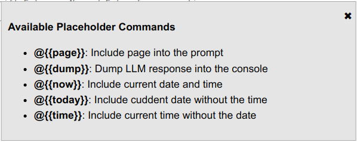

# localAI

### Use local AI within the browser


Oh! Antohter AI tool!

Why, indeed? Well, even those AI tools that support web browsing can't reach all web content. If interested in the topic, search the web or take a look [here](https://www.technologyreview.com/2024/03/19/1089919/the-ai-act-is-done-heres-what-will-and-wont-change/).

In short, AIs are not allowed to access all content. But you, as a user, can. This is where this tool comes in handy. It uses the content loaded into a tab, allowing it to help you with tasks such as summarising. It is a helper that can use the information available to you as a user and can't go beyond that.

So, what can it do? It works with your current active tab only. It keeps all data local—no sharing, sending, or storing your actions for later. You have full control. You decide whether to keep it or delete it.

Additionally, you can define, store (locally, of course), and execute predefined prompts.

Apart from that, it works like any other AI UI—ChatGPT, Ollama, Llamafile, etc. It is just an interface to your preferred local AI tool.

Supported tools are (those providing a local endpoint API):

* [LM Studio](https://lmstudio.ai/)
* [Ollama](https://ollama.com/)
* [Mozilla LlamaFile](https://github.com/Mozilla-Ocho/llamafile)

To use it, you need:

1. One or more of these services running on your local system.
2. An extension for your browser.

| | Browser | Extension |
|-|---------|-----------|
| | Chrome |  [link](http://localhost)|
| | Firefox |  [link](http://localhost)|


Upon installation of this extension, you'll see the icon in the bottom-right corner. It will respond to mouse hover/over.


Click it to open the main UI.


# Usage

Hover the top of the head on the bottom right corner with the mouse and the head will come out:


The red cross near the ear allows temporarily hiding the head—only for the current tab and until it is reloaded.


Click the head to open the panel.

# The panel

## Ribbon


The ribbon at the top gives some quick access options:
From left to right there are:

### Menu
Click to toggle the menu


The changes made here are temporary for the session, (until reload) and for the current tab only.


* On the top is the API endpoint where AI prompts are sent to.
* If [Ollama](https://ollama.com/) is used as an endpont, next dropdown will be populated with the available model names. **It is mandatory** to select one, otherwise an error will be trown.
* The `webhook` is for future use - no impact currently
* The last menu will open extension's options in a new tab.

### Session
 - new session

 - Show session list. Click to reload any.

 - Delete sessions

Sessions can be managed also from the [Options](#options) page.

# System instructions

 - Edit system instructions. **Only for the session**. Use the [Options](#options) page to set permanent system instructions.


### Other

 - Pin panel.

 - Unpin panel.

If the pannel is not pinned (default) then clicking outside the panel will hide it. This behaviour can be changed from the [Options](#options) page.

 - Hide the panel

## Prompt area
When empty, it provides a short information about the available options.

### Attach file

Just drag and drop a file. **Note:** only plain text files can be used currently.


Click on the file icon to delete it.

### Commands

#### System Commands

There are two types of commands: system and custom. System commands start with `@` and are enclosed within double brackets `{{}}`. Those are predefined commands and cannot be modified. To view the list of the available system commands type `/help`.



#### Custom Commands

Custom commands are user defined prompts. Usually, those are prompts often used and this will help avoiding repetitive typing the same prompt again and again.


To use a predefined custom command type its name after a slash `/` and press `Enter`, or use any of the buttons available:


Pressing `Enter` will execute it as if it has been typed as a prompt text followed by `Enter` key. Buttons above each command give alternative actions related with the command:

 - edit command prompt.

 - executed the command.

 - copy and paste command's content into the prompt area.

 - delete this command. **Note:** No `Undo` is available,

To view available custom commands, type `/list` in the prompt.

Custom command can include system commands. Example:

```
summarise @{{page}}
```

This will send the content of the page from current active tab to the AI with a requiest to generate a summary.

# Options


## Troubleshoot

#### Ollama 403 Error

1. sudo nano /etc/systemd/system/ollama.service
2. Add this line in the mentioned section

```
[Service]
Environment="OLLAMA_ORIGINS=*"
```
3. Save and exit
4. restart the service

```
sudo systemctl daemon-reload
sudo systemctl restart ollama
```