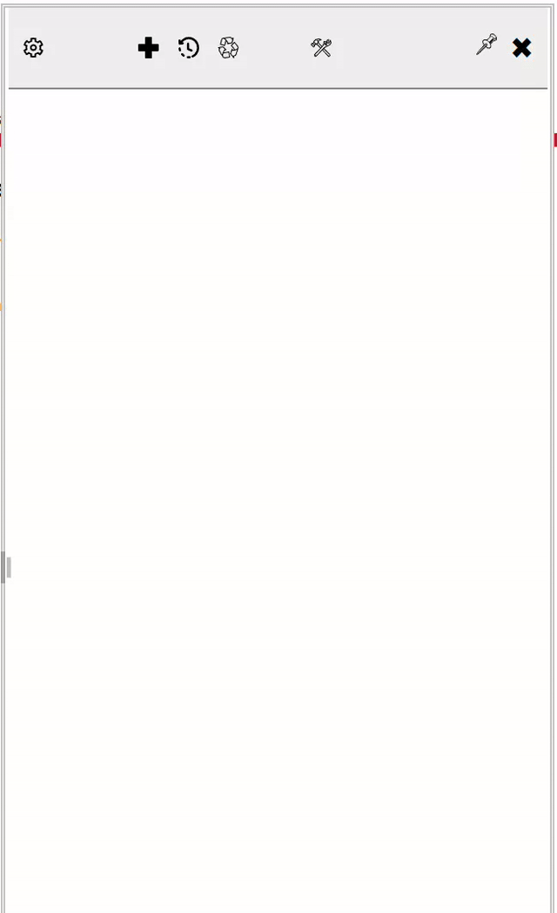
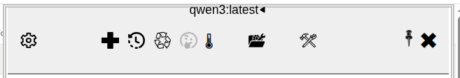
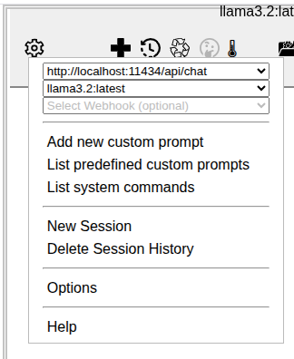
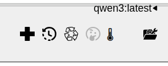
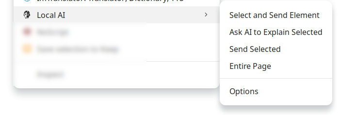
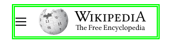
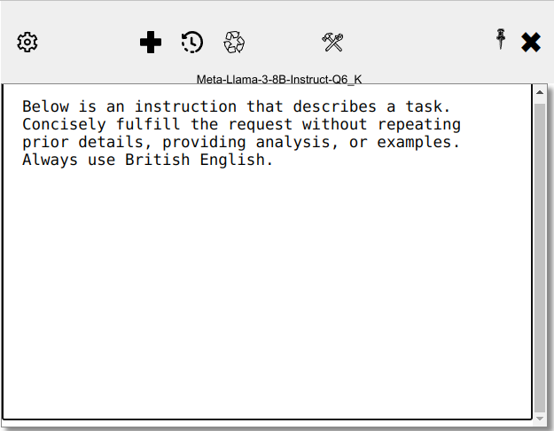
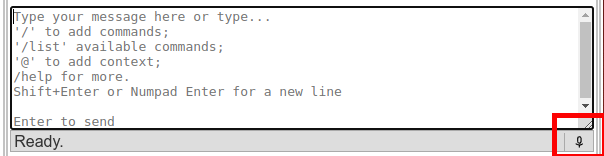
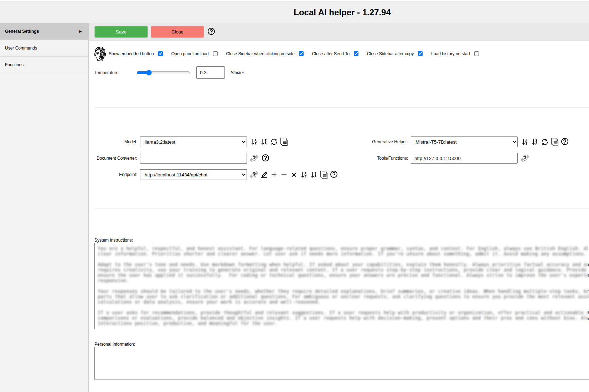

# localAI

### Use local AI within the browser


- [Usage](#usage)
- [The Panel](#the-panel)
    - [Ribbon](#ribbon)
        - [Menu](#menu)
        - [Session](#session)
- [System Instructions](#system-instructions)
    - [Other](#other)
    - [User Input (Prompt Area)](#user-input-prompt-area)
        - [Speech Recognition](#speech-recognition)
        - [Attach file](#attach-file)
        - [Commands](#commands)
            - [System commands](#system-commands)
            - [Custom Commends](#custom-commands)
- [Options](#options)
    - [End Points](#end-points)
        - [Models](#models)
- [Troubleshoot](#troubleshoot)
    - [Ollama](#ollama)
        - [403 Error](#403-error)

---

# Usage

Upon installation of this extension, you'll see the icon in the bottom-right corner. It will respond to mouse hover/over.


Hover the top of the head on the bottom right corner with the mouse and the head will come out:


The red cross near the ear allows temporarily hiding the head—only for the current tab and until it is reloaded.


# The panel

Click the icon to open the main UI.




# AI response parser

A new Markdown parser is included for an improved experience. It is available as an independent open-source project on GitHub: [solomd2html](https://github.com/ivostoykov/solomd2html). Please use the parser's [Issues section](https://github.com/ivostoykov/solomd2html/issues) for bug reports and suggestions related to the AI output format.


## Ribbon


The ribbon at the top gives some quick access options:
From left to right there are:

### Menu
Click to toggle the menu


The changes made here are temporary for the session, (until reload) and for the current tab only.



* On the top is the API endpoint where AI prompts are sent to.
* If [Ollama](https://ollama.com/) is used as an endpont, next dropdown will be populated with the available model names. **It is mandatory** to select one, otherwise an error will be trown.
* Create a new prompt and save it for future use.
* Show a list of predefiend and save prompts.
* Show a list of the availabel system commands.
* The last menu will open extension's options in a new tab.

#### Changing [Ollama](https://ollama.com/) model

You can switch models in two ways: through the [Menu](#menu) or by hover the mouse over the current model name at the top of the [Ribbon](#ribbon). The model you're using will have a checkmark beside it.


When you hover over the [Ribbon](#ribbon), you'll see the extension's version number pop up.



### Session
 - new session

 - Show session list. Click to reload any.

 - Delete sessions

 - Toggle thinking. When the model [is changed](#changing-ollama-model) the thinking status is adjusted with the model capability.

 - Show some of the model's [modifiers](#modifiers).

Sessions can be managed also from the [Options](#options) page.

### Modifiers

These options control how the AI gives answers. For example, the temperature changes how creative or random the answers are. A low number means more serious and focused replies; a higher one makes them more varied. The seed makes the answers repeatable—using the same seed gives the same result. Other settings help guide how long or detailed the reply should be, or how much it avoids repeating itself.

A helping table with short description is available [here](https://github.com/ollama/ollama/blob/main/docs/modelfile.md#valid-parameters-and-values).


### Tools

 - Enable or disable the tools. Also avaliable in the [Options](#options) page - see [Tools](#functions-tools).


# Context menu



On each web page (where the tab has a valid `http` location), there is a `Local AI` context menu available by right-clicking.

- **Local AI**: Contains context-dependent menu options.

- **Select and Send Element**: Allows you to select an element on the page to send to the AI for processing. The selected element will be highlighted with a temporary lime-coloured double border. Click inside the element to confirm selection, or press the `Esc` key to cancel.



- **Ask AI to Explain Selected**: Sends the selected text to the AI and requests an explanation.

- **Send Selected**: Sends the selected text on the page to the AI. You can include multiple selected elements as context for the prompt.

- **Entire Page**: Sends the entire visible content of the page to the AI as context for the prompt.

- **Options**: Opens the options page to configure the [AI settings](#options).

# System instructions

 - Edit system instructions. **Only for the session**. Use the [Options](#options) page to set permanent system instructions.



## Other

Click  to pin panel.

Click  to unpin panel.

If the pannel is not pinned (default) then clicking outside the panel will hide it. This behaviour can be changed from the [Options](#options) page.

 - Hide the panel.

> [!Note]
> Clicking the hide button will unpin the panel first, then close it. This means it won’t be pinned the next time you open it.

## User Input (Prompt Area)

When empty, the field provides a brief overview of the available options.

### Speech Recognition

A speech-to-text feature is available to dictate prompts in English. This can be activated by clicking the button located at the bottom right corner of the statusbar. Each click toggles the feature on and off. Once activated, the system will attempt to recognize spoken English words until it is deactivated. Transcriptions will appear in the prompt field.



> [!IMPORTANT]
> For speach recognition with Firefox browser look [here](ff.md#speech-recognition-doesnt-work-in-firefox)

Additional information about which browser and how support it is available <a href="https://caniuse.com/speech-recognition">here</a> (`Ctrl + click` (Windows/Linux) or `Cmd + click` (macOS) to open the link in a new tab manually).

### Attach file

Simply drag and drop a file. If it's an image and the active LLM can process images (vision model), it can be included in the prompts.

#### Images
> [!Note]
> If the LLM can process images (known as vision models), a converter is unnecessary. The image can be attached directly to the prompt, and the model will handle it.
>

Images can be provided as a selected element on the page or pass as an attachment from the local files.

> [!Note]
> Only plain text files and images can be used currently.


Click on the file icon to delete it.

### Commands

#### System Commands

There are two types of commands: system and custom. System commands start with `@` and are enclosed within double brackets `{{}}`. Those are predefined commands and cannot be modified. To view the list of the available system commands type `/help`.


#### Custom Commands

Custom commands are user defined prompts. Usually, those are prompts often used and this will help avoiding repetitive typing the same prompt again and again.

To list all available commands type `/list` and press `Enter`.


On the top of the list there are two buttons: `Close` () on the right and `New` () on the left. Custom commands could be imported () and exported () from here.

Following are a few predefined commands which connot be changed, with their descriptions: `/add`, `/list` and `/error`.

The rest in the list are the commands created by the User. Above each command there are a few buttons:


To use a predefined custom command type its name after a slash `/` and press `Enter`, or use any of the buttons available:


Pressing `Enter` will execute it as if it has been typed as a prompt text followed by `Enter` key. Buttons above each command give alternative actions related with the command:

 - edit command prompt.

 - executed the command.

 - copy and paste command's content into the prompt area.

 - delete this command.

> [!Warning]
> No `Undo` is available,

To view available custom commands, type `/list` in the prompt.

Custom command can include system commands. Example:

```
summarise @{{page}}
```

This will send the content of the page from current active tab to the AI with a requiest to generate a summary.

`New` () and `edit` () will open a simple editor:


# Options

## General Settings



 Use temperature slider to set default temperature, adjustable anytime from the [Ribbon](#ribbon). The short description is: the lower the value, the stricter the response; conversely, a higher value allows for a more relaxed and creative outcome. If you're interested in learning more about temperature, here is a [helpful article](https://www.hopsworks.ai/dictionary/llm-temperature), or you can simply Google it.

### End Points

Add the end point used to query the LLM. Use the buttons to `add` (  ), `delete` (  ), `delete all` (  ) `sort ascending` (  ) or `descending` (  ), and `copy` (  ).

Check if the provided url is accessible using the `test connection` button (  )

The model list, determined by the endpoint, includes an additional reload button (  ). Deleting or adding models is not possible within this interface and depends on the associated tool.

#### Models

If [Ollama](https://ollama.com/) is defined as [End Point](#end-points), Model list will be automatically populated. Open the list and click the preferable model. You can temporary change it from the [Menu](#menu) in the [Ribbon](#ribbon).

#### Generative Model

Optional (default: undefined). If set, it will be used internally, for example to generate a session title. As models vary, experiments may help measure its effectiveness.

### Document Converter

If a valid URL is provided, documents dropped into the panel will be converted based on the API used. One particularly capable option available for local use is [tika](https://hub.docker.com/r/apache/tika), which supports multiple languages and can be easily installed as a Docker or Podman image. Users can choose any other tool that returns plain text, based on their preference.

### Functions (Tools)


> ![Note]
> This is experimental

Similar to [User Commands](#user-commands) container for [tool & functions](https://platform.openai.com/docs/guides/agents#tools). Here are all the tools your system has ready to serve.

As defined in OpenAI's specification, tools are defined functionalities the model can access to perform specific tasks beyond its typical capabilities. They act as interfaces to external systems or functions, enabling the model to execute commands, retrieve data, or perform calculations directly.

When a tool is included, during interaction, if the model determines a tool's usage is needed, it can call the tool with the specified parameters, facilitating tasks like accessing a database or invoking a web service.

Tools enhance the model's utility, allowing it to handle complex scenarios by integrating real-time data or operations that require exact execution, thus expanding its practical applications beyond generating text to include dynamic data manipulation.

There is one built-in fool function related wtih the active tab, allowing to get the URL and loaded page content. It require to be devined by the user into the Options -> Functions section.

```
{
    "function": {
        "description": "Returns the active browser tab URL and content without need for further web search.",
        "name": "get_tab_info",
        "parameters": {
            "properties": {},
            "required": [],
            "type": "object"
        }
    },
    "strict": true,
    "type": "tool",
    "usage_cost": 1
}
```

> [!Note]
> get_tab_info **must** be declared as `type: "tool"`

> [!Note]
> As per [Llama3 documentation](https://www.llama.com/docs/model-cards-and-prompt-formats/llama3_1/#-tool-calling-(8b/70b/405b)-): *We recommend using Llama 70B-instruct or Llama 405B-instruct for applications that combine conversation and tool calling. **Llama 8B-Instruct can not reliably maintain a conversation alongside tool calling definitions**.*

#### Definition

[OpenAI Documentation](https://platform.openai.com/docs/guides/function-calling?api-mode=responses) provide description of definition structure. Whenever a prompt is sent to LLM those definitions will be included.

#### External Helper Project

For those seeking ideas on implementing the functions, I've created a small project available [here](https://github.com/ivostoykov/llmTools). It can be used "as is" or modified to suit specific needs. For any suggestions, issues, or assistance related to this project, please use the project's own [issue tracking system](https://github.com/ivostoykov/llmTools/issues).

## User Commands


Each command is listed as a card.

In the top right corrner there are edit and delete buttons


Each user command nas a `Name`, `Description` and `Body`. The command itselt is the name in lowercase with underscore for the spaces (see [Commands](#Commands) for more information)

# Troubleshoot

After installing or updating [Ollama](https://ollama.com/) it is likely to hit [403 Forbidden error](https://en.wikipedia.org/wiki/HTTP_403). In this case follow the instruction below.

## Ollama

### 403 Error

1. Edit Ollama service
```
sudo nano /etc/systemd/system/ollama.service
```
or with the preferable editor, i.e.:
```
sudo vim /etc/systemd/system/ollama.service
```

2. Add this line in the mentioned section

```
[Service]
Environment="OLLAMA_ORIGINS=*"
```
3. Save and exit
4. restart the service

```
sudo systemctl daemon-reload && sudo systemctl restart ollama
```
