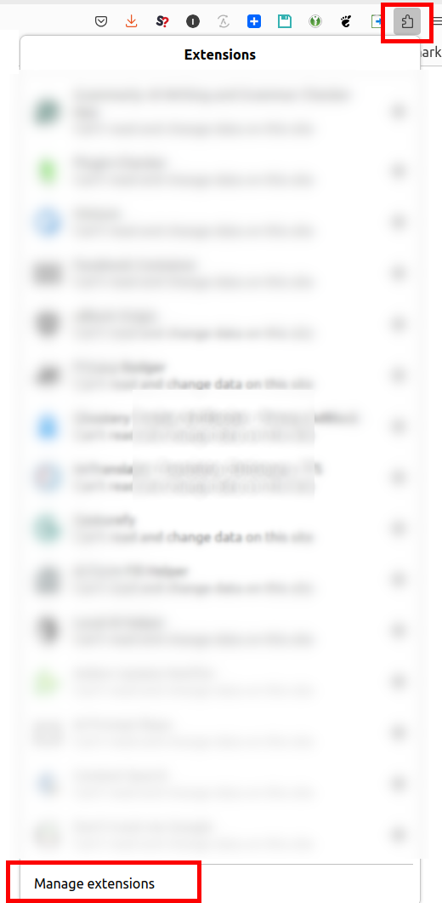

If you're looking for a general usage directions - [read here](README.md)

# Important Troubleshooting

If you're using Firefox >= 158 it probably worth to keep reading.

## Set up the permissions required to run this add-on

1. Click on the add-ons icon (on the right of the URL bar)

2. Find Local AI Helper in the list and click the three horisontal dots on the right. Click `Manage` menu.

3. This will open permissions and other settings related to the add-on. Click `Permissions` tab.

4. Switch the `Access your data for all websites` slider on if it is not.

This will allow add-on to interact with the `activeTab`.